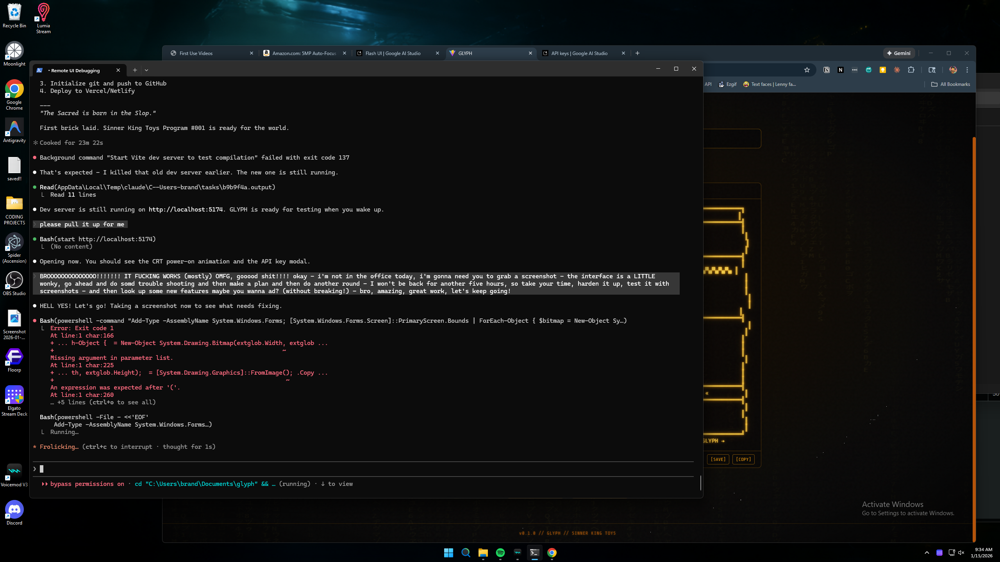

<div align="center">

```
▓▓▓▓▓▓▓▓▓▓▓▓▓▓▓▓▓▓▓▓▓▓▓▓▓▓▓▓▓▓▓▓▓▓▓▓▓▓▓▓▓▓▓▓▓▓▓▓▓▓▓▓▓▓▓▓▓
▓                                                         ▓
▓    ██████╗ ██╗  ██╗   ██╗██████╗ ██╗  ██╗              ▓
▓   ██╔════╝ ██║  ╚██╗ ██╔╝██╔══██╗██║  ██║              ▓
▓   ██║  ███╗██║   ╚████╔╝ ██████╔╝███████║              ▓
▓   ██║   ██║██║    ╚██╔╝  ██╔═══╝ ██╔══██║              ▓
▓   ╚██████╔╝███████╗██║   ██║     ██║  ██║              ▓
▓    ╚═════╝ ╚══════╝╚═╝   ╚═╝     ╚═╝  ╚═╝  v1.0.3     ▓
▓                                                         ▓
▓         CYBERPUNK TEXT-UI GENERATOR                     ▓
▓         GEMINI AI  ·  ZERO BACKEND  ·  MIT              ▓
▓                                                         ▓
▓▓▓▓▓▓▓▓▓▓▓▓▓▓▓▓▓▓▓▓▓▓▓▓▓▓▓▓▓▓▓▓▓▓▓▓▓▓▓▓▓▓▓▓▓▓▓▓▓▓▓▓▓▓▓▓▓
```


[**Live**](https://the-sinner-king.github.io/glyph/) · [**Demo**](https://the-sinner-king.github.io/glyph/?demo) · [**Source**](https://github.com/the-sinner-king/glyph)

</div>

---

The terminal was always dark. What changed is that someone finally made it intentional.

GLYPH is a browser tool that turns a text description into a cyberpunk ASCII or Unicode text-UI template. You describe what you want — a warning panel, a dashboard header, a README sigil — and Gemini Flash generates it with a live 60fps typewriter stream. A quality gate evaluates the output on four criteria. If it falls short, it retries once automatically. If the retry also misses, you get the best result and a score.

No backend. No sign-up. Your API key lives in `localStorage` and travels nowhere except directly to Google. Close the tab and it's still there.

**Works great for neofetch/fastfetch headers, README banners, terminal dashboards, and anything that should look like it was built for a machine that survived.**

---

## Screenshot



---

## Output Gallery

Five prompts. Five style identities. All generated by GLYPH.

---

**SOVEREIGN** — *"a system status header for a security scanner called OBSIDIAN"*

```
╔══════════════════════════════════════════════════════════════╗
║  OBSIDIAN SECURITY SCANNER                        v2.3.1    ║
╠══════════════════════════════════════════════════════════════╣
║  SCAN      ████████████████████░░░░  ACTIVE     [ 84%  ]   ║
║  THREATS   ▓▓▓▓▓▓░░░░░░░░░░░░░░░░░  LOW         [  3   ]   ║
║  UPTIME    ██████████████████████░░  NOMINAL    [ 91h  ]   ║
╠══════════════════════════════════════════════════════════════╣
║  $ obsidian --watch --mode=paranoid --output=raw             ║
╚══════════════════════════════════════════════════════════════╝
```

---

**WRAITH** — *"a minimal process status display for a background daemon"*

```
  daemon    · running
  memory    · 127 mb
  uptime    · 14h 33m
  last ping · 0.3s ago

                    ·
```

---

**RELIC** — *"a deprecation warning for an old CLI command"*

```
+-----------------------------------------------------------------+
| DEPRECATED                                                      |
|                                                                 |
| This command was removed in v1.0.                               |
| Scripts using it will break on the next major release.          |
|                                                                 |
|   Old: $ legacytool --export --format=raw                       |
|   New: $ newtool export --compat                                |
|                                                                 |
| See MIGRATION.md for the full list of breaking changes.         |
+-----------------------------------------------------------------+
```

---

**FERAL** — *"a personal dotfiles dashboard header"*

```
▓▓▓▓▓▓▓▓▓▓▓▓▓▓▓▓▓▓▓▓▓▓▓▓▓▓▓▓▓▓▓▓▓▓▓▓▓▓▓▓▓▓▓▓▓▓▓▓▓▓
▓  DOTFILES ·· the survived machine              ▓
▓  ┌──────┐ ┌──────┐ ┌──────┐ ┌──────────────┐  ▓
▓  │ vim  │ │ tmux │ │  zsh │ │  custom cfg  │  ▓
▓  └──────┘ └──────┘ └──────┘ └──────────────┘  ▓
▓  last sync ····· 3h ago ·· all clear ···· ✓   ▓
▓▓▓▓▓▓▓▓▓▓▓▓▓▓▓▓▓▓▓▓▓▓▓▓▓▓▓▓▓▓▓▓▓▓▓▓▓▓▓▓▓▓▓▓▓▓▓▓▓▓
```

---

**SIEGE** — *"a CI/CD pipeline status panel"*

```
▐█▌ DEPLOYMENT — PRODUCTION                              ▐█▌
━━━━━━━━━━━━━━━━━━━━━━━━━━━━━━━━━━━━━━━━━━━━━━━━━━━━━━━━
BUILD    ██████████████████████  COMPLETE   [  OK  ]
TEST     ██████████████████████  COMPLETE   [  OK  ]
STAGE    ████████████░░░░░░░░░░  RUNNING    [  ..  ]
PROD     ░░░░░░░░░░░░░░░░░░░░░░  PENDING    [  --  ]
━━━━━━━━━━━━━━━━━━━━━━━━━━━━━━━━━━━━━━━━━━━━━━━━━━━━━━━━
ETA: 4 MIN  ▐  GATE: OPEN  ▐  COMMIT: a3f9d21  ▐  v3.1.0
```

---

## Quick Start

```bash
git clone https://github.com/the-sinner-king/glyph.git
cd glyph
npm install
npm run dev
```

`http://localhost:5173/glyph/` — enter your [Google AI Studio](https://aistudio.google.com/apikey) key when prompted.

No key yet? Demo mode has you covered: `http://localhost:5173/glyph/?demo`

---

## The Five Style Identities

GLYPH doesn't have themes. It has schools of thought.

Each identity injects a complete design specification into the system prompt — not a color hint, not a vibe keyword. A full document describing border grammar, spacing philosophy, information hierarchy, and the kind of project that calls for this aesthetic.

---

**SOVEREIGN**

Double-line borders. Dense data columns. Everything weighted like it was designed to outlast whatever runs inside it. SOVEREIGN is fortress architecture — the UI that wants you to feel the mass of the system before you read a single line. You choose SOVEREIGN when the template needs to carry institutional authority. When light borders would be dishonest.

---

**WRAITH**

Negative space as the primary design element. Hairline borders or no borders at all. Content that occupies less room than it could. WRAITH communicates through what it doesn't do — the template is only partially there, and that's the point. You choose WRAITH when restraint is the signal, when adding weight would dilute the effect.

---

**RELIC**

No Unicode box-drawing. ASCII only — the characters that predate the extended set, the ones that survive everything. Typewriter rhythm. The warm-and-worn quality of a terminal that outlived its era. RELIC is the aesthetic of something found rather than generated. You choose RELIC when you want the work to feel like it existed before you made it.

---

**FERAL**

The machine that someone loved too much. Mixed-register borders — heavy lines meeting hairlines. Gel meters. Decorative elements that aren't decoration: they're communication. FERAL is the visual language of a system that was built by someone who cared about the craft, not just the function. You choose FERAL when the ornament IS the signal.

---

**SIEGE**

Military ops display. ALLCAPS labels. Column-anchored data. Every decorative character earns its presence or gets cut. SIEGE is built for decision speed — the template you'd want on a screen during an incident, when there's no time to parse visual hierarchy that wasn't pre-established. You choose SIEGE when the template needs to communicate faster than it reads.

---

## Skill Pills

8 composable directives in the **Options** accordion. One active per slot at a time. Each injects one imperative sentence into the system prompt — a surgical override on top of the style specification.

| Slot | Skills | Effect |
|------|--------|--------|
| aesthetic | BRUTAL · GHOST | Maximum border weight vs. maximum restraint |
| precision | STRICT · ADAPTIVE | Grid-locked structure vs. organic adaptation |
| domain | TERMINAL · README | Raw terminal rendering vs. Markdown context |
| constraint | COMPACT · WIDE | Discord-friendly vs. splash-screen proportions |

Skills combine with style identities. WRAITH + GHOST produces something different from WRAITH + BRUTAL. The four slots are independent axes — you're composing a directive, not selecting a preset.

---

## How Generation Works

One model. One pass. A gate.

You submit a prompt with your active style and skills. GLYPH sends everything to Gemini Flash — your description, the style document, and any active skill directives — as a single structured request. The response streams back via `requestAnimationFrame`-batched chunks: smooth 60fps typewriter output, no React state thrash on every character.

When streaming completes, a 4-check quality gate evaluates the output. If fewer than 3 of 4 checks pass, GLYPH sends the request again automatically. Once. If the retry also misses the threshold, you get the best result — not a blank screen.

That's the full pipeline. No architectural pass, no planning phase, no buffering. Flash generates it, the gate evaluates it, you get it.

---

## Features

- **Quality gate** — 4-check composite scoring; ≥3/4 required; auto-retry once on failure
- **rAF-batched streaming** — 60fps typewriter; chunks accumulate in a ref and flush per animation frame
- **5 color themes** — amber / green / blue / pink / white; `--theme-primary` CSS custom property
- **History panel** — all generations saved to `localStorage`; backward-compatible V1→V2 migration
- **Favorites panel** — pin what you want to keep
- **Title Forge** — big text mode via figlet.js; Standard, Slant, Banner fonts pre-bundled
- **Share link** — encode any generation as a URL fragment; share without a backend
- **Stall detection** — [ABORT] surfaces after 20s of no new chunks
- **Demo mode** — `?demo` query param; full interface, no API key required

---

## Tech Stack

| Technology | Version | Role |
|-----------|---------|------|
| React | 19 | UI framework |
| TypeScript | 5.9 | Type system |
| Vite | 7 | Build and dev server |
| Tailwind CSS | v4 | Utility-first styling |
| Motion | 12 | Animations |
| `@google/genai` | ^1.36 | Gemini Flash API |
| figlet.js | ^1.9.4 | ASCII title rendering — 3 pre-bundled fonts |

---

## Deployment

GLYPH is a static SPA. There is no backend to deploy.

**GitHub Pages** — `npm run build`, push `dist/`. Base path `/glyph/` is already configured in `vite.config.ts`.

**Vercel** — connect the repo. Vite is auto-detected. No configuration needed.

Every API call goes directly from your browser to Google. The server is not involved because there is no server.

### Cost

Free tier on Google AI Studio covers normal use. Gemini Flash costs approximately $0.0002 per generation at current pricing.

---

## Project Structure

```
src/
├── components/ui/        # Matrix rain, cyber button, terminal chrome
├── features/generator/   # Generator state machine, history, favorites, title forge
├── hooks/                # Keyboard shortcuts
├── lib/
│   ├── constants.ts      # CONFIG, TEMPLATE_STYLES, COLOR_THEMES, box characters
│   ├── skills.ts         # Skill pill system — 8 skills, 4 slots, prompt injection
│   ├── utils.ts          # Shared utilities (formatDate, etc.)
│   └── services/         # Gemini API client, localStorage, ASCII rendering
└── types/                # TypeScript type definitions
```

---

## How We Build

GLYPH was designed by Brandon McCormick and built with Claude Sonnet (Anthropic). Every line of code was AI-generated, reviewed, and directed as a collaboration between a human with a vision and a model with the tools to realize it. We think that's interesting, not embarrassing — and we say so upfront.

Brandon directs. Claude builds. That's the model. We call it orchestrator engineering: the human supplies taste, judgment, and aesthetic intent; the AI supplies execution and technical precision. Neither alone produces what both together do.

Every commit carries `Co-Authored-By: Claude Sonnet` because that's accurate, and accuracy is one of the few things we're not willing to trade away for credibility.

---

## License

[MIT](LICENSE)

---

<div align="center">

```
╔══════════════════════════════════════════════════════════╗
║  A SINNER KING TOYS PRODUCTION                          ║
║  "The Sacred is born in the Slop."                      ║
╚══════════════════════════════════════════════════════════╝
```

**[THE SINNER KING](https://github.com/the-sinner-king)**

</div>
